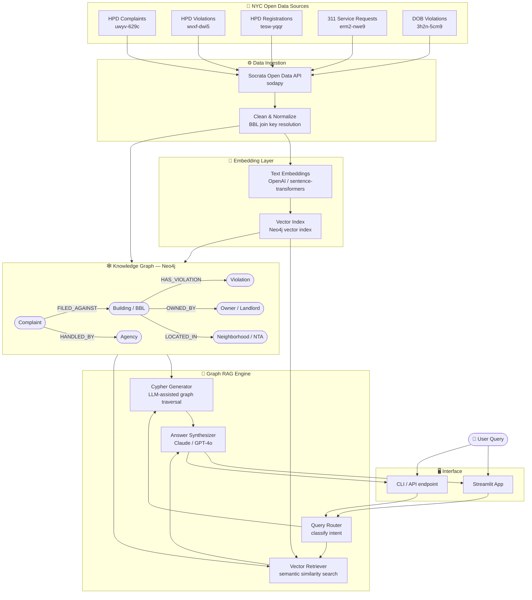

# Who's Watching Your Building?
### A Graph RAG System for NYC Housing Accountability

> Connecting fragmented open data into a knowledge graph that exposes patterns of housing neglect, landlord accountability, and agency responsiveness across New York City.

---

## Overview

New York City generates millions of housing complaints every year. Each one lives in a dataset. Each dataset lives in a silo. This project tears down those silos.

**Who's Watching Your Building?** is a Graph RAG (Retrieval-Augmented Generation) system built on NYC open data. It links HPD complaints, code violations, property registrations, and 311 service requests into a unified knowledge graph — then puts a natural language query interface on top of it. Ask it a question in plain English; it reasons across relationships that no single spreadsheet could capture.

This is the kind of tool that matters to tenants fighting negligent landlords, journalists investigating slumlords, housing advocates tracking displacement, and policy researchers studying where city agencies fall short.

---

## The Core Insight

The raw datasets are fine. The *relationships between them* are where the story lives.

Every NYC property has a **BBL** (Borough-Block-Lot) — a unique identifier shared across virtually all city property datasets. BBL is the universal join key that makes this graph possible:

```
(Complaint) -[FILED_AGAINST]-> (Building/BBL)
(Building)  -[HAS_VIOLATION]-> (Violation)
(Building)  -[OWNED_BY]->      (Landlord)
(Building)  -[LOCATED_IN]->    (Neighborhood/NTA)
(Complaint) -[HANDLED_BY]->    (Agency)
(Violation) -[INSPECTED_BY]->  (Inspection)
```

With this graph, you can answer questions that defeat flat databases entirely:

- *"Which buildings in Crown Heights have recurring heat complaints AND open HPD violations AND the same owner?"*
- *"Are there landlords with unresolved violations across multiple buildings?"*
- *"What agencies are slowest to close complaints in the South Bronx?"*

These are **multi-hop reasoning** questions — exactly what Graph RAG is designed for, and exactly where vanilla vector RAG falls flat.

---

## Data Sources

All data is sourced from [NYC Open Data](https://opendata.cityofnewyork.us/) via the **Socrata Open Data API (SODA)**.

| Dataset | SODA ID | Role in Graph | Join Key |
|---|---|---|---|
| HPD Housing Maintenance Code Complaints | `uwyv-629c` | Core complaint nodes | BBL, building_id |
| HPD Violations | `wvxf-dwi5` | Violation nodes linked to buildings | BBL |
| HPD Registrations | `tesw-yqqr` | Landlord/owner identity nodes | BBL |
| NYC 311 Service Requests | `erm2-nwe9` | Complaint volume & agency routing | BBL (filtered to `agency='HPD'`) |
| DOB Violations | `3h2n-5cm9` | Structural/permit violations (enrichment) | BBL |

---

## Architecture



---

## Tech Stack

| Layer | Technology |
|---|---|
| Data ingestion | Python, `sodapy` |
| Graph database | Neo4j (Community or AuraDB free tier) |
| Graph querying | Cypher |
| Embeddings | OpenAI `text-embedding-3-small` or `sentence-transformers` |
| Vector index | Neo4j vector index (built-in) or pgvector |
| LLM reasoning | Claude or GPT-4o via API |
| Query orchestration | LangChain or LlamaIndex (GraphRAG module) |
| Interface | Streamlit |

---

## Project Phases

### Phase 1 — Data Acquisition & Exploration
- [ ] Set up SODA API access and pull core datasets
- [ ] Explore schema, null rates, and BBL coverage
- [ ] Document join logic and data quality issues

### Phase 2 — Graph Construction
- [ ] Define node types: `Building`, `Complaint`, `Violation`, `Owner`, `Agency`, `Neighborhood`
- [ ] Define relationship types and cardinalities
- [ ] Load graph into Neo4j; validate traversals with sample Cypher queries

### Phase 3 — Embedding & Vector Layer
- [ ] Identify text fields worth embedding (complaint descriptors, resolution text)
- [ ] Generate embeddings and attach to graph nodes
- [ ] Build hybrid retrieval: graph traversal + vector similarity

### Phase 4 — Graph RAG Query Engine
- [ ] Implement query router: classify questions as graph-traversal, vector, or hybrid
- [ ] Build Cypher generation from natural language (LLM-assisted)
- [ ] Synthesize multi-source context into coherent LLM answers

### Phase 5 — Interface & Demo
- [ ] Streamlit app with example queries and graph visualization
- [ ] Document 3–5 showcase queries that demonstrate multi-hop reasoning
- [ ] Write up findings / patterns surfaced by the system

---

## Example Queries

Once the system is running, queries like these should work out of the box:

```
"Show me all buildings owned by [landlord name] with open violations"

"Which neighborhoods have the longest average time to close heat complaints?"

"Find buildings with more than 10 complaints in the last year and no resolved violations"

"Are there owners whose buildings cluster around the same block with similar complaint patterns?"
```

---

## Why This Project

This is a portfolio demonstration of **fourth-wave open data** thinking — the idea that the value of open data isn't in any single dataset, but in the network of relationships you can build across them. First-wave open data put spreadsheets online. Fourth-wave open data makes those spreadsheets talk to each other.

Graph RAG is the right tool for this because housing accountability is inherently a graph problem: who owns what, what happened there, who was responsible, what came next. Flat retrieval misses the structure. This project doesn't.

---

## Getting Started

```bash
git clone https://github.com/[your-username]/whos-watching-your-building
cd whos-watching-your-building
pip install -r requirements.txt

# Set up environment variables
cp .env.example .env
# Add your SODA app token, Neo4j credentials, and LLM API key

# Pull data and build graph
python scripts/ingest.py
python scripts/build_graph.py

# Launch interface
streamlit run app.py
```

> **Note:** A Neo4j instance is required. The free [AuraDB](https://neo4j.com/cloud/platform/aura-graph-database/) tier works for development.

---

## License

MIT

---

## Acknowledgments

Built on NYC Open Data, maintained by the NYC Office of Technology and Innovation. Data sourced via the [Socrata Open Data API](https://dev.socrata.com/).
